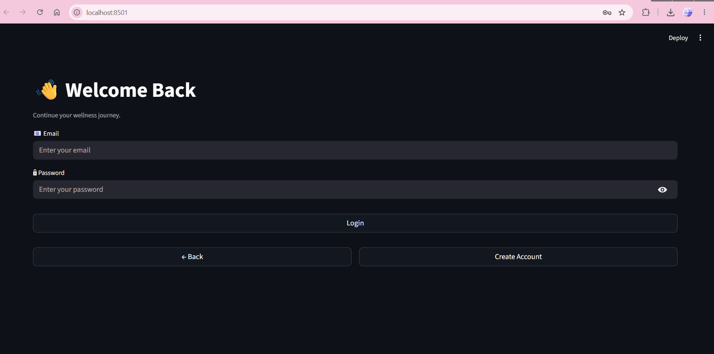
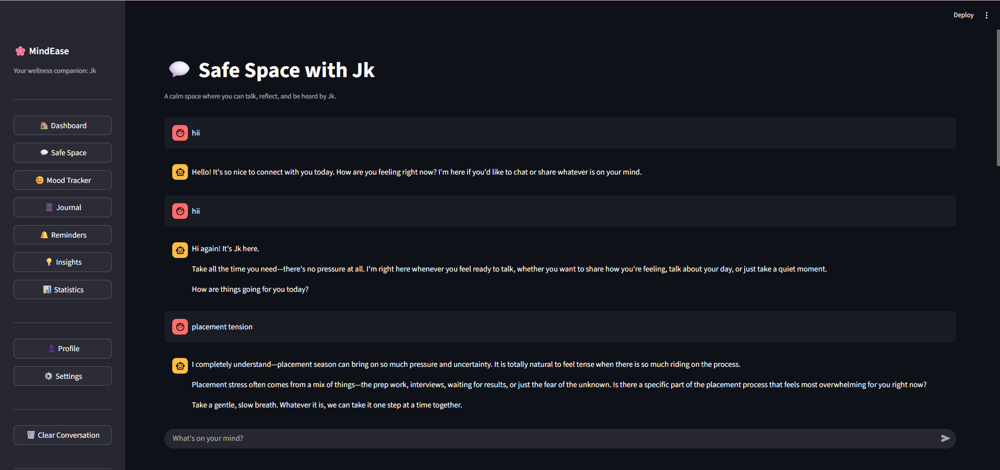
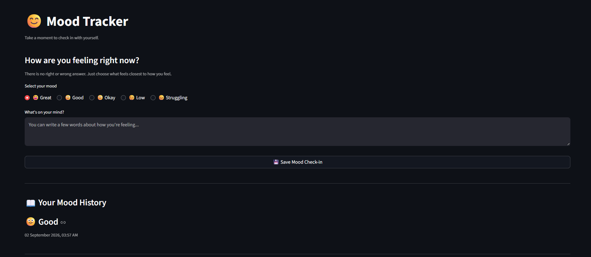
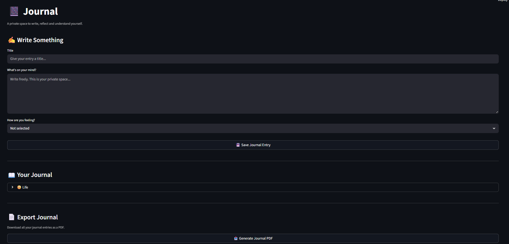
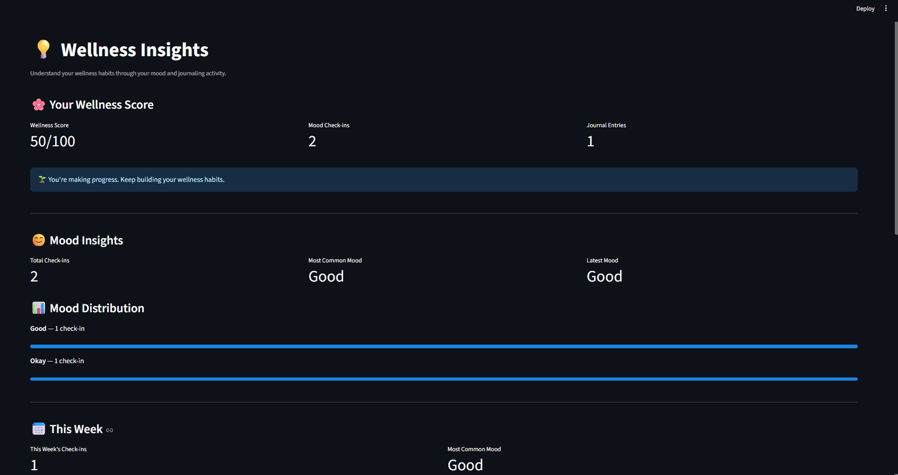
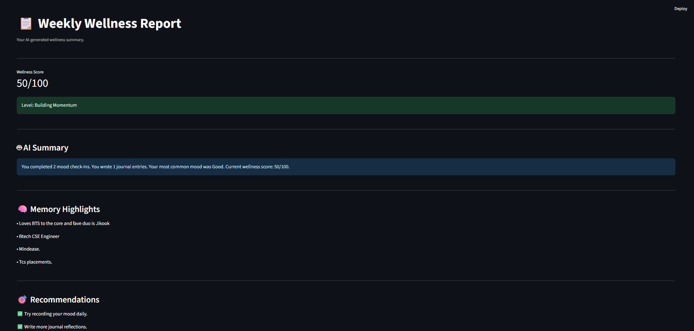

# 🌸 MindEase – AI Mental Wellness Platform

## 📌 Overview

MindEase is an AI-powered mental wellness platform designed to support emotional well-being through personalized conversations, mood tracking, journaling, wellness insights, and daily self-reflection.

The platform combines Artificial Intelligence with wellness-focused features to create a safe and supportive environment where users can express their thoughts, track emotional patterns, and build healthy habits.

---

## 🚀 Features

### 🤖 AI Safe Space

* AI-powered wellness companion using Gemini AI
* Personalized conversations
* Context-aware responses
* User-defined AI companion name
* Long-term memory support

### 🧠 AI Memory System

* Stores important user preferences
* Remembers goals and personal context
* Personalized future conversations
* Memory management (view, edit, delete)

### 😊 Mood Tracker

* Daily mood check-ins
* Mood history tracking
* Weekly mood analysis
* Emotional pattern recognition

### 📔 Smart Journal

* Daily journaling system
* Personal reflection space
* Journal history management
* PDF export support

### 💡 AI Wellness Insights

* Wellness score calculation
* Personalized wellness recommendations
* Mood and journal analysis
* AI-generated wellness summaries

### 📊 Statistics Dashboard

* Mood activity statistics
* Journal activity tracking
* Wellness engagement metrics
* Progress visualization

### 📅 Weekly Wellness Reports

* AI-generated weekly summaries
* Mood analysis
* Wellness score reports
* Personalized recommendations

### 🌅 Daily Check-In System

* Morning mood check-in
* Night reflection journal
* Daily wellness streak tracking

### 👤 User Profile

* Profile management
* Wellness overview
* Activity summary
* Account information

### 🔐 Authentication System

* Secure Login
* User Registration
* Password hashing
* Session management

---

## 🛠️ Tech Stack

### Frontend

* Streamlit

### Backend

* Python

### Database

* SQLite
* SQLAlchemy ORM

### AI

* Google Gemini API

### Data Visualization

* Plotly

### Authentication

* Passlib
* Secure Password Hashing

### PDF Generation

* ReportLab

### Environment Management

* Python Virtual Environment
* dotenv

### Version Control

* Git
* GitHub

### Deployment

* Docker

---

## 📂 Project Structure

```text
MindEase/
│
├── app.py
│
├── database/
├── models/
├── features/
│   ├── ai/
│   ├── auth/
│   ├── safe_space/
│   ├── mood/
│   ├── journal/
│   ├── reminders/
│   ├── insights/
│   ├── statistics/
│   ├── reports/
│   ├── profile/
│   └── preferences/
│
├── ui/
│   ├── components/
│   └── pages/
│
├── storage/
│
├── requirements.txt
├── Dockerfile
├── docker-compose.yml
└── README.md
```

---

## 📸 Application Screenshots

### Login Page


### Dashboard


### Safe Space AI Chat


### Mood Tracker


### Journal


### Insights


### Weekly Report


## ⚙️ Installation

### Clone Repository

```bash
git clone https://github.com/dhanvantari12/MindEase-AI-Mental-Wellness-Platform.git
cd MindEase
```

### Create Virtual Environment

```bash
python -m venv .venv
```

### Activate Environment

#### Windows

```bash
.venv\Scripts\activate
```

#### Linux / Mac

```bash
source .venv/bin/activate
```

### Install Dependencies

```bash
pip install -r requirements.txt
```

---

## 🔑 Environment Variables

Create a `.env` file in the project root.

```env
GEMINI_API_KEY=YOUR_API_KEY
```

---

## 🗄️ Create Database

```bash
python -m database.create_tables
```

---

## ▶️ Run Application

```bash
streamlit run app.py
```

Application will be available at:

```text
http://localhost:8501
```

---

## 🐳 Docker Deployment

### Build Docker Image

```bash
docker build -t mindease .
```

### Run Container

```bash
docker run -p 8501:8501 mindease
```

---

## 📈 Future Enhancements

* AI Goal Tracking System
* Habit Builder
* Smart Wellness Recommendations
* Calendar Integration
* Email Notifications
* Advanced Analytics Dashboard
* Multi-language Support
* Mobile Application

---

## 🎯 Learning Outcomes

This project helped develop practical skills in:

* Full Stack Development
* Python Application Development
* Database Design
* SQLAlchemy ORM
* AI Integration
* Authentication Systems
* Streamlit Development
* Docker Deployment
* Git & GitHub Workflow
* Software Architecture

---

## 👩‍💻 Author

**Dhanvantari Dayanand Akolkar**

B.Tech Computer Science & Engineering (2027)

Passionate about AI, Full Stack Development, Data Analytics, and Building Real-World Software Solutions.

GitHub:
https://github.com/dhanvantari12

Project Repository:
https://github.com/dhanvantari12/MindEase-AI-Mental-Wellness-Platform

---

## 📜 License

This project is developed for educational, learning, and portfolio purposes.
