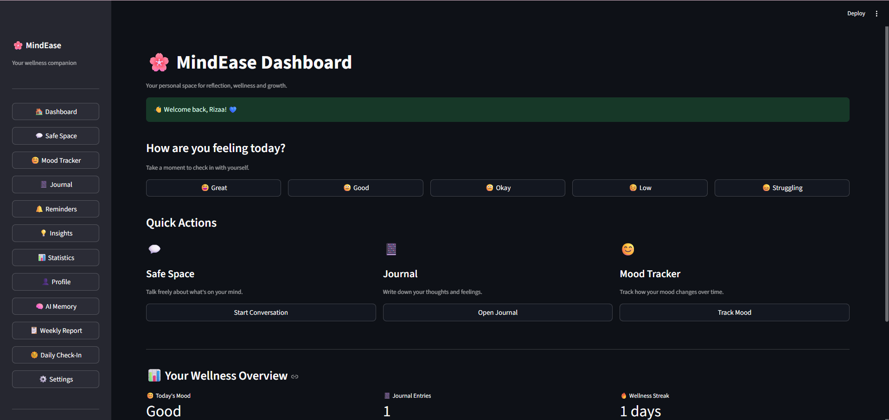

# 🌸 MindEase – AI Mental Wellness Platform


## 📌 Overview

MindEase is an AI-powered mental wellness platform designed to support emotional well-being through personalized conversations, mood tracking, journaling, wellness insights, and daily self-reflection.

The platform combines Artificial Intelligence with wellness-focused features to create a safe and supportive environment where users can express their thoughts, track emotional patterns, and build healthy habits.

---

## ✨ Key Highlights

- AI-powered wellness companion using Google Gemini
- Long-term memory system for personalized conversations
- Mood tracking and emotional analytics
- Smart journaling with PDF export
- AI-generated wellness insights and weekly reports
- Daily check-ins and reminder system
- Secure authentication and session management
- Fully Dockerized deployment

---

## 🚀 Features

### 🤖 AI Safe Space
- Gemini AI powered wellness companion
- Personalized conversations
- Context-aware responses
- User-defined AI companion name
- Long-term memory support

### 🧠 AI Memory System
- Stores important user preferences
- Remembers goals and personal context
- Personalized future conversations
- Memory management (view, edit, delete)

### 😊 Mood Tracker
- Daily mood check-ins
- Mood history tracking
- Weekly mood analysis
- Emotional pattern recognition

### 📔 Smart Journal
- Daily journaling system
- Personal reflection space
- Journal history management
- PDF export support

### 💡 AI Wellness Insights
- Wellness score calculation
- Personalized recommendations
- Mood and journal analysis
- AI-generated wellness summaries

### 📊 Statistics Dashboard
- Mood activity statistics
- Journal activity tracking
- Wellness engagement metrics
- Progress visualization

### 📅 Weekly Wellness Reports
- AI-generated weekly summaries
- Mood analysis
- Wellness score reports
- Personalized recommendations

### 🌅 Daily Check-In System
- Morning mood check-in
- Night reflection journal
- Daily wellness streak tracking

### 👤 User Profile
- Profile management
- Wellness overview
- Activity summary
- Account information

### 🔐 Authentication System
- Secure Login
- User Registration
- Password hashing
- Session management

---

## 🛠️ Tech Stack

### Frontend
- Streamlit

### Backend
- Python

### Database
- SQLite
- SQLAlchemy ORM

### AI
- Google Gemini API

### Data Visualization
- Plotly

### Authentication
- Passlib
- Secure Password Hashing

### PDF Generation
- ReportLab

### Deployment
- Docker

### Version Control
- Git
- GitHub

---

## 📂 Project Structure

```text
MindEase/
│
├── app.py
├── database/
├── models/
├── features/
│   ├── ai/
│   ├── auth/
│   ├── safe_space/
│   ├── mood/
│   ├── journal/
│   ├── reminders/
│   ├── insights/
│   ├── statistics/
│   ├── reports/
│   └── profile/
│
├── ui/
│   ├── components/
│   └── pages/
│
├── storage/
├── requirements.txt
├── Dockerfile
└── README.md
```

---

## ⚙️ Installation

### Clone Repository

```bash
git clone https://github.com/dhanvantari12/MindEase-AI-Mental-Wellness-Platform.git
cd MindEase-AI-Mental-Wellness-Platform
```

### Create Virtual Environment

```bash
python -m venv .venv
```

### Activate Environment

Windows:

```bash
.venv\Scripts\activate
```

Linux / Mac:

```bash
source .venv/bin/activate
```

### Install Dependencies

```bash
pip install -r requirements.txt
```

---

## 🔑 Environment Variables

Create a `.env` file:

```env
GEMINI_API_KEY=YOUR_API_KEY
```

---

## 🗄️ Create Database

```bash
python -m database.create_tables
```

---

## ▶️ Run Application

```bash
streamlit run app.py
```

Application URL:

```text
http://localhost:8501
```

---

# 🐳 Docker Support

## Build Docker Image

```bash
docker build -t mindease .
```

## Run Docker Container

```bash
docker run -d -p 8501:8501 --env-file .env --name mindease-app mindease
```

## Open Application

```text
http://localhost:8501
```

---

## Useful Docker Commands

### View Running Containers

```bash
docker ps
```

### View Logs

```bash
docker logs mindease-app
```

### Stop Container

```bash
docker stop mindease-app
```

### Remove Container

```bash
docker rm mindease-app
```

---

## Deployment Ready

MindEase can be deployed on:

- Render
- Railway
- AWS ECS
- Azure Container Apps
- Google Cloud Run
- DigitalOcean
- Any VPS supporting Docker

---

## 📸 Screenshots

Add screenshots inside a `screenshots/` folder and link them here.

Example:

```markdown

```

---

## 📈 Future Enhancements

- AI Goal Tracking
- Habit Builder
- Calendar Integration
- Email Notifications
- Multi-language Support
- Mobile Application

---

## 🎯 Learning Outcomes

This project helped develop practical skills in:

- Full Stack Development
- Python Application Development
- Database Design
- SQLAlchemy ORM
- AI Integration
- Authentication Systems
- Streamlit Development
- Docker Deployment
- Git & GitHub Workflow
- Software Architecture

---

## 👩‍💻 Author

**Dhanvantari Dayanand Akolkar**

B.Tech Computer Science & Engineering (2027)  
KIT's College of Engineering, Kolhapur

GitHub:
https://github.com/dhanvantari12

Project Repository:
https://github.com/dhanvantari12/MindEase-AI-Mental-Wellness-Platform

---

## 📜 License

This project is developed for educational, learning, and portfolio purposes.